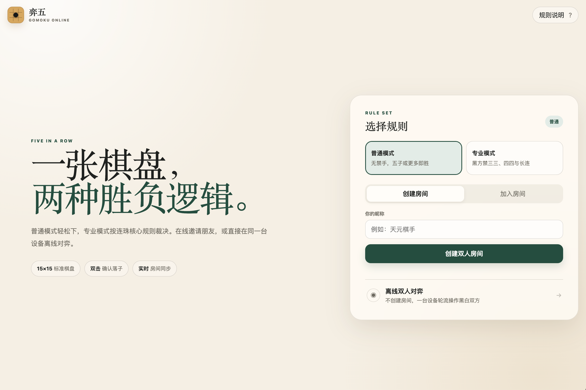
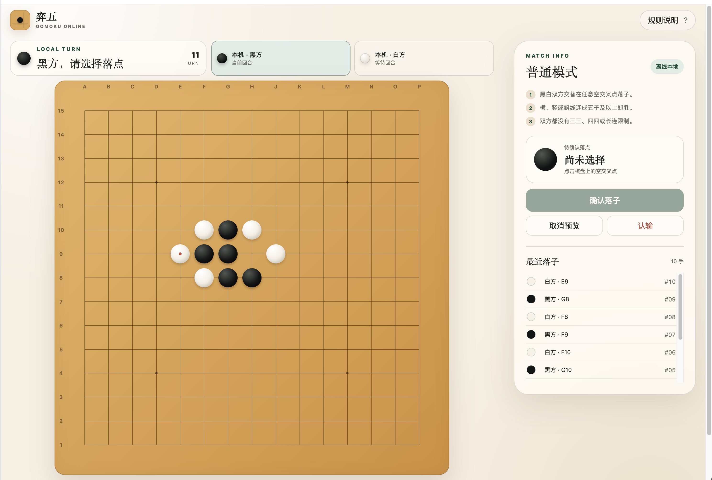

# 弈五 · Gomoku Online

一款同时支持在线私人房间与离线双人对弈的网页版五子棋。前端使用原生 HTML、CSS、JavaScript，在线房间服务使用 Python 标准库，无第三方运行依赖，也没有前端构建步骤。

## 功能

- 15×15 标准棋盘，适配电脑、iPad、手机横竖屏。
- 防误触落子：第一次点击显示半透明虚子，第二次点击同一点才确认；也可点击“确认落子”。
- 普通模式：无禁手，双方五子或更多相连即胜。
- 专业模式：黑方首手天元，禁止三三、四四和长连；黑方恰好五连获胜，白方五连或长连获胜。
- 在线模式：创建或加入六位房间号，服务端权威校验回合、胜负和禁手，通过 SSE 实时同步。
- 离线模式：一台设备轮流操作黑白双方，不创建房间、不连接服务端。
- 在线房间可在开局前交换先后手；对局结束后双方确认交换，会直接按新先后手开始下一局。
- 可无限次悔棋，但只能由未落下最后一子的对方撤销最后一颗棋子。
- 认输、双方确认再来一局、最近落子记录、断线重连和过期状态保护。

## 界面预览

### 游戏大厅



### 对局界面



## 本地运行

```bash
python3 server/app.py --host 127.0.0.1 --port 4173
```

浏览器打开 <http://127.0.0.1:4173/>。

## 测试

```bash
python3 -m unittest discover -s tests -v
```

项目未引入打包器；静态文件可直接由 Python 服务或任意静态服务器提供。

## 服务器部署

项目附带 Nginx 与 systemd 部署配置，默认发布在 `/wuziqi/` 子路径：

```bash
sudo python3 deployment/install.py --source . --domain example.com
```

安装后静态页面由 Nginx 托管，`/wuziqi/api/` 转发到本机 Python 房间服务。

## 专业规则边界

专业模式实现国际连珠规则中的核心棋盘、胜负和黑方禁手逻辑。三三判断不是简单图形匹配：只有能够通过合法着法形成“活四”的三才计入，并递归排除会在延伸点产生禁手的假活三。

国际正式赛事还会按赛事选择 Soosyrv、Taraguchi、Yamaguchi 等开局规程。本项目当前采用黑方首手天元的直接对弈流程，不模拟编珠、换手和第五手多点提案，因此界面明确称为“连珠核心规则”，而不是某一届赛事完整赛制。

规则依据：

- [Renju International Federation — International Rules of Renju](https://gomoku.renju.net/rifrules/)
- [RenjuNet — beginner rules and forbidden-move tutorial](https://old.renju.net/study/rules.php)

## 安全与状态

- 玩家令牌使用安全随机数生成，只保存在当前浏览器会话中，不进入邀请链接。
- 服务端限制请求体大小并对来源 IP 做基础频率限制。
- 客户端提交 `expectedVersion`，避免在过期棋盘上落子。
- 房间当前保存在服务进程内存中；服务重启后未结束房间失效。
- 仓库不保存真实域名、服务器地址、密码、私钥或其他环境凭据。
